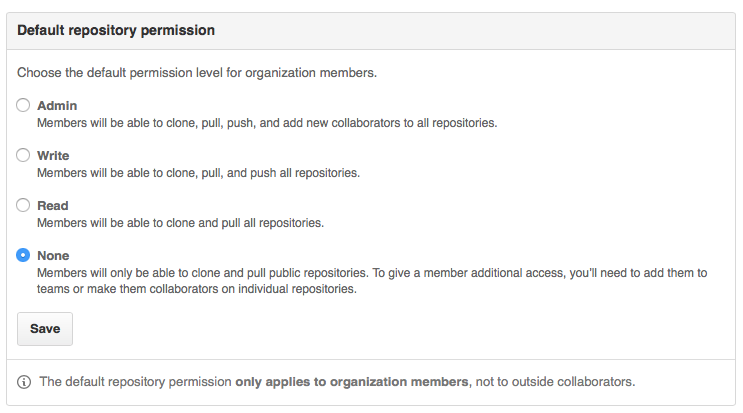

# Using GitHub in the Classroom

GitHub offers private (and of course public) repositories for students to use in the classroom through its [education initiative](https://education.github.com). This give students hands-on experience with version control and writing code in an individual setting (e.g. homework assignments) or collaborative setting (e.g. final projects). If you would like your students to submit assignments using git/GitHub, this is a tutorial that walks you through the process of setting it up.  

Here, I'm demonstrating the ideas using the [GitHub Organization datasciencelabs-students](https://github.com/datasciencelabs-students), 
which was created for submitting homework assignments in the [Introduction to Data Science course](http://datasciencelabs.github.io/) at the Harvard School of Public Health. We followed the [GitHub Education Classroom guide](https://education.github.com/guide) for this. To create private repositories for each student for each homework assignment, we followed the [sandboxing setup](https://education.github.com/guide/sandboxing). 

For more information about [`teachers_pet`](http://www.rubydoc.info/gems/teachers_pet)

# Setting up `teachers_pet`

1. Set up [two factor authentication on GitHub](https://help.github.com/articles/about-two-factor-authentication/) with your mobile device (e.g. google authenticator). You may have to [check the SSH key on GitHub matches SSH key on your computer](https://help.github.com/articles/generating-an-ssh-key/). 

2. Create an [access token for command line](https://help.github.com/articles/creating-an-access-token-for-command-line-use/). Save this token immediately in `.bash_profile` and add a phone number as backup. 

3. Install the [`specific_install` gem](https://github.com/rdp/specific_install) which allows you to install a gem from a GitHub repo or a URL. 

	$ gem install specific_install

4. Install the `teachers_pet` gem from the [https://github.com/stephaniehicks/teachers_pet](https://github.com/stephaniehicks/teachers_pet). I merged branches from two repositories: (1) [`teachers_pet` on CS 109](https://github.com/cs109/teachers_pet.git) which allows you to push files to specific branches and (2) [the `delete-repos` branch on `teachers_pet` on GitHub Education repository](https://github.com/education/teachers_pet.git) which allows you to delete repositories after your class is complete.  This allows you to recycle the quota of private repos. 

	$ gem specific_install https://github.com/stephaniehicks/teachers_pet.git

#### Potential problems

If you are not able to push/pull after setting up 2FA authentication, read [http://olivierlacan.com/posts/why-is-git-https-not-working-on-github/](http://olivierlacan.com/posts/why-is-git-https-not-working-on-github/) and 
[https://help.github.com/articles/https-cloning-errors/](https://help.github.com/articles/https-cloning-errors/). 

For example, if you have enabled two-factor authentication, you must provide a personal access token instead of entering your password for HTTPS Git.

# Running `teachers_pet`

## Settings in GitHub Organization

After you have created your GitHub Organization (e.g. `datasciencelabs-students`), you must change the default repository permission (under Settings) to "None" (Members will only be able to clone and pull public repositories. To give a member additional access, you'll need to add them to teams or make them collaborators on individual repositories.). 

This ensures as you add each member (or student) to the organization, they will only be able to see the repositories that you give them access to. 

## Creating assignments

When using the sandboxing setup, you will need to create the repositories for the students. 
For each assignment, use the `create_repos` action to create a repository for each student. 
The repositories are technically created per team, but if you use `create_student_teams` first, then there will be one team per student. Start with one student GitHub username per line in a file called `students.txt` in your working directory. This will create one team per student. This ensures that each student will only have access to the repositories in his/her "team" and not any other "teams".  

	$ teachers_pet create_student_teams --students=students.txt --organization=datasciencelabs-students

## Add all students and TAs to datasciencelabs-students

	$ teachers_pet add_to_team --members=students.txt --organization=datasciencelabs-students

You can also create an "Owners.txt" file with one TA GitHub username per line. This will create a team for all the TAs involved with your course.  If you changed the the default repository permission settings to "None" as mentioned above, then you must manually change the organizational role of each TA or instructor that will be involved with the grading.  

	$ teachers_pet add_to_team --members=Owners.txt --organization=datasciencelabs-students

## Create repos for them (default is private repos)

	$ teachers_pet create_repos --organization=datasciencelabs-students --repository=2016HW2 --students=students.txt

This will create empty repositories for each student called `<student-GitHub-username>-2016HW2`.  For every homework assignment, you will repeat this process and change the name of the repository. 

## Pushing starter files

When creating repositories for students, you will often want to include boilerplate files. After running `create_repos`, create a new git repository called `2016HW2` with the starter files (e.g. README.md, or homework problems, .gitignore, Makefiles, etc.). This repository can be a local clone from some remote repository or it can just a git repository on your local computer. Change into that directory and use the `push_files action` to place that starter files in the repositories for each student. This works by creating a Git remote for each student repository, and doing a git push to each one. (i.e. the command treats the student repos on github as remotes) 

	$ cd 2016-HW2

	$ teachers_pet push_files --organization=datasciencelabs-students --repository=2016HW2 --students=../students.txt

**Note**: You can push files to specific branches with the `--branch` argument.  e.g. If you want to push files from a specific branch, change to that branch of the repository using `git checkout <name-of-branch>` and then push from there. 

	$ cd 2016-HW2

	$ teachers_pet push_files --organization=datasciencelabs-students --repository=2016HW2 --students=../students.txt --branch=<name-of-branch>

## Deleting repos

At the end of your course, if you want to recycle the private repositories to be able to use them again in your next course, use the `delete_repos` command. **Warning**:  There is no un-doing this step. Once you delete the private repositories, you cannot get them back.  Only run this command after all your students have a chance to clone / copy their homework assignments, if they wish.  

	$ teachers_pet delete_repos --organization=datasciencelabs-students --repository=2016HW2 --students=../students.txt

